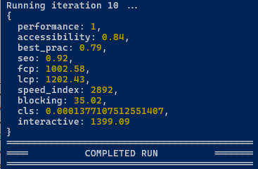
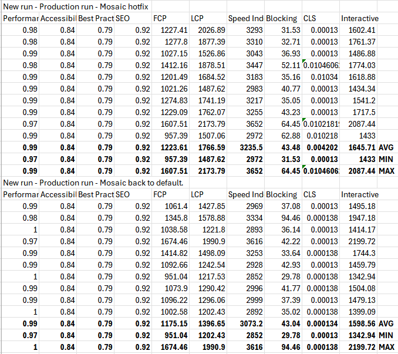

# NodeJS based Lighthouse Performance Test for Web Pages
Basic lighthouse (web vitals) performance testing script, written in Node.JS.

It'll do multiple runs, outputting results into a CSV including a row for average, min and max values.

Example usage

```
node index.js "Initial run without changes"
```

Edit the script to alter things like;
- The page URL you're testing.
- Number of iterations.
- Report filename.

(you could easily alter the script to accept these as parameters if you need to).




